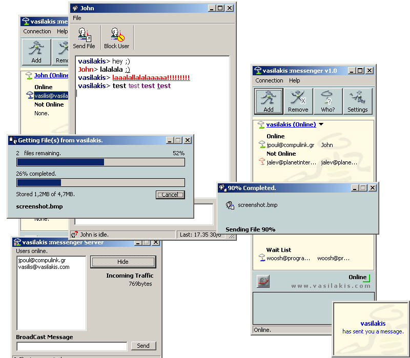



## Advanced Messenger Service \(Server \- Client\) \- Full Code, no ocx\! \*UPDATED\*

### Description

This is a messenger service created just for fun. It is very nice written, and *as much as I could* bug-free. It includes: the Messenger client, the messenger Server, the Banner Server and the database of the program for SQL Server. It support multi-file transfer, email checking and many other features. It is just like MSN Messenger but of course not that advanced :P You should see it, it might help you a lot. Everything is pure source code. That means you need a lot of api calls :p The projects does not have comments, but I think it won't be very difficult to understand my functions and subs. Please send me a feedback, or email me for any questions at vasilis@vasilakis.com. *NOW SUPPORT MS ACCESS*
 
### More Info
 

             |
---                |---
**Submitted On**   |2002-10-02 13:12:34
**By**             |[vasilakis](https://github.com/Planet-Source-Code/PSCIndex/blob/master/ByAuthor/vasilakis.md)
**Level**          |Intermediate
**User Rating**    |4.9 (211 globes from 43 users)
**Compatibility**  |VB 6\.0
**Category**       |[Internet/ HTML](https://github.com/Planet-Source-Code/PSCIndex/blob/master/ByCategory/internet-html__1-34.md)
**World**          |[Visual Basic](https://github.com/Planet-Source-Code/PSCIndex/blob/master/ByWorld/visual-basic.md)
**Archive File**   |[Advanced\_M14681210162002\.zip](https://github.com/Planet-Source-Code/vasilakis-advanced-messenger-service-server-client-full-code-no-ocx-updated__1-38495/archive/master.zip)

### API Declarations

A lot!!!! (@ source of course)

